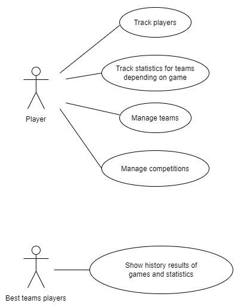

# Yellow Yak

## Authors, github name:
1. Matej Horniak, MatejHor
2. Lukas Mikula, Lukinooo 
3. Matej Knazik, D1LL1G4F
4. Boris Petrenko, oreqizer

## Assigment
### Online gaming management system
The goal of the system is to manage teams of users participating to eSports competitions. The system should allow to
track the different team members with their records and statistics depending on different online games. It should also
allow to manage the teams and their results in the competitions against other teams. Competitions with other teams can
be set in some location together with prizes and score results from all the participants. History of all the results can
be seen by the users with the best teams according to different games and statistics.

##  Class diagram


## UseCase diagram



## REST api

1. ```mvn clean install -DskipTests``` 
2. ```cd GamingManagement-rest```
3. ```mvn cargo:run``` 

OR

```mvn clean install -DskipTests && cd GamingManagement-rest && mvn cargo:run```

REST url: http://localhost:8080/pa165/rest/

## API

Competition:
* `GET /competitions/:id` -> `CompetitionFacade.findById`
* `POST /competitions` -> `CompetitionFacade.create`
* `DELETE /competitions/:id` -> `CompetitionFacade.remove`
* `GET /competitions/game/:gameId=` -> `CompetitionFacade.findByGame`

Game:
* `GET /games/:id` -> `GameFacade.findById`
* `POST /games` -> `GameFacade.create`
* `DELETE /games/:id` -> `GameFacade.remove`
* `GET /games?name=` -> `GameFacade.findByName`
* `GET /games` -> `GameFacade.findAll`

Player:
* GET /players/ -> PlayerFacade.findAll  
```curl -i -X GET http://localhost:8080/pa165/rest/players/```
* GET /players/:id -> PlayerFacade.findById  
```curl -i -X GET http://localhost:8080/pa165/rest/players/{id}```
* POST /players -> PlayerFacade.create  
```curl --location --request POST 'http://localhost:8080/pa165/rest/players/create' --header 'Content-Type: application/json' --data-raw '{"username": "player_8", "email": "player_8@gmail.com"}'```
* DELETE /players/:id -> PlayerFacade.remove  
```curl -i -X DELETE http://localhost:8080/pa165/rest/players/{id}```
* GET /players/username/:username -> PlayerFacade.findByUsername  
```curl -i -X GET http://localhost:8080/pa165/rest/players/username/{username}```
* GET /players/team/:teamId -> PlayerFacade.findByTeam  
```curl -i -X GET http://localhost:8080/pa165/rest/players/team/{teamId}```

Score:
* `GET /score/:id` -> `ScoreFacade.findById`
* `POST /score` -> `ScoreFacade.create`
* `POST /score/result` -> `ScoreFacade.setResult` business 1
* `DELETE /score/:id` -> `ScoreFacade.remove`
* `GET /score?game=&player=` -> `ScoreFacade.findByPlayerGame`
* `GET /score?competition=` -> `ScoreFacade.findByCompetition` business 2
  
Team:
* GET /teams/:id -> TeamFacade.findById
```curl -i -X GET http://localhost:8080/pa165/rest/teams/{id}```
* POST /teams -> TeamFacade.create
```curl --location --request POST 'http://localhost:8080/pa165/rest/teams/create' --header 'Content-Type: application/json' --data-raw '{"name": "team_6"}'```
* DELETE /teams/:id -> TeamFacade.remove
```curl -i -X DELETE http://localhost:8080/pa165/rest/teams/{id}```
* GET /teams?name= -> TeamFacade.findByName
```curl -i -X GET http://localhost:8080/pa165/rest/teams/?name={name}```

Auth:
* POST /login -> Auth.login for admin email: admin@gaming.com password: admin
```curl --location --request POST 'http://localhost:8080/pa165/rest/login' --header 'Content-Type: application/json' --data-raw '{"email": "admin@gaming.com", "password": "admin"}'```

### Auth flow

- visit `/`
- user enters **email** and **password**
- call to `/login`, returns `{ token: string }`
- app gets unlocked, further calls contain header `Authorization` with value
  `Bearer <token>` (without the `<>`), check every request
